# Handheld Multi-Frame Super-Resolution Documentation

## Overview

This repository is an educational, GPU-accelerated implementation of the handheld burst super-resolution method described by Wronski et al. and detailed by Lafenetre, Facciolo, and Eboli in *Implementing Handheld Burst Super-Resolution* (IPOL, 2023). It reconstructs a denoised, demosaicked RGB image from a short handheld RAW burst.

The implementation accepts a directory of DNG files. The first file returned by the filesystem glob is used as the reference frame; every other file is aligned and fused into that reference. Although older repository text mentions other RAW extensions, the current loader searches for `*.dng` files only.

The main public API is `handheld_super_resolution.process(burst_path, config)`. The command-line entry point is [run_handheld.py](../run_handheld.py).

## What The Algorithm Does

Hand motion creates small sub-pixel shifts between frames. Once these shifts are estimated, samples from several Bayer mosaics can be placed on a higher-resolution grid. Combining them also reduces noise, while a robustness mask limits contributions from moving objects, occlusions, and registration failures.

```mermaid
flowchart LR
    A[DNG burst] --> B[RAW normalization and metadata]
    B --> C[Estimate SNR and adaptive settings]
    C --> D[Build grayscale reference pyramid]
    D --> E[Coarse-to-fine block matching]
    E --> F[ICA sub-pixel alignment]
    F --> G[Robustness mask]
    G --> H[Structure-adaptive kernels]
    H --> I[Robust weighted fusion]
    I --> J[Optional denoising and ISP]
    J --> K[PNG or DNG output]
```



### Noise model and variance stabilization

The pipeline assumes an affine signal-dependent noise model:

$$
\sigma_n^2(I) = \alpha I + \beta,
$$

where $I$ is the normalized RAW intensity, $\alpha$ describes shot noise, and $\beta$ describes read noise. The values are read from the DNG noise-profile metadata unless explicitly supplied. They are used to generate noise curves and in the generalized Anscombe transform before estimating image structure.

### Registration

For each non-reference frame, the code first estimates a tile-wise displacement field on a Gaussian pyramid. At each level, block matching minimizes either an L1 or L2 patch error within the configured search radius. Inverse compositional alignment (ICA) then refines each displacement using image gradients and a per-tile Hessian, yielding sub-pixel alignment.

### Robustness

The robustness map downweights samples that disagree with the reference beyond what the noise model predicts. It also penalizes locally irregular motion. This protects the fusion from moving subjects, occlusions, blur mismatch, and poor alignment. Robustness is valuable for real handheld bursts but can remove useful samples in highly dynamic scenes.

### Structure-adaptive fusion

Each raw sample contributes through a Gaussian kernel. At output position $p$, the fused color is a normalized weighted sum:

$$
\hat I(p) = \frac{\sum_{n}\sum_{q} r_n(q)\,w_n(p,q)\,J_n(q)}
{\sum_{n}\sum_{q} r_n(q)\,w_n(p,q)},
$$

where $J_n(q)$ is a RAW sample, $r_n(q)$ is its robustness weight, and $w_n$ is the spatial kernel weight. For a covariance $\Omega$, the steerable kernel uses:

$$
w(p,q) = \exp\left(-\tfrac{1}{2}(q-p)^T\Omega^{-1}(q-p)\right).
$$

The covariance comes from the local structure tensor. Kernels become anisotropic around edges, preserving detail along an edge while smoothing more safely across noisy flat regions.

## Strengths And Limitations

### Strengths

- Simultaneous demosaicking, denoising, and multi-frame super-resolution from Bayer DNG bursts.
- Robust fusion reduces artifacts from scene motion and failed correspondence.
- Structure-adaptive kernels preserve edges better than purely isotropic filtering.
- SNR-based defaults adapt tile size and fusion parameters to the input exposure.
- CUDA execution via Numba and PyTorch makes the approach practical on a modern NVIDIA GPU.

### Limitations

- The current input loader requires a non-empty directory of `.dng` files with compatible dimensions, CFA layout, metadata, and exposure characteristics.
- A CUDA-capable NVIDIA GPU is effectively required: several tensors and kernels are created directly on `cuda`.
- The first DNG becomes the reference; the implementation does not select the sharpest frame.
- Fast camera motion, rolling-shutter distortion, large parallax, textureless regions, saturation, or independently moving objects can defeat the tile-wise motion model.
- More than approximately 2x enlargement should not be expected to reveal proportionally more optical detail; sampling and lens blur impose a physical limit.
- The code is research-oriented. The first run includes Numba JIT compilation and may be much slower than subsequent runs. Its memory use and speed are not tuned to production-camera levels.
- DNG output needs external tools (`exiftool` and Adobe DNG SDK `dng_validate`); PNG output does not.

## Installation

### Local Conda installation

Use a CUDA toolkit compatible with both the NVIDIA driver and the selected PyTorch/Numba packages. The supplied [environment.yaml](../environment.yaml) is a starting point:

```bash
conda env create -f environment.yaml
conda activate handheld
pip install omegaconf
```

`omegaconf` is imported by the CLI and pipeline but is not currently listed in [requirements.txt](../requirements.txt), so it must be installed explicitly. Verify that CUDA is available before processing:

```bash
python -c "import torch; print(torch.cuda.is_available(), torch.cuda.get_device_name(0))"
```

On Windows, WSL is recommended when Numba/CUDA installation is problematic. The NVIDIA driver must be installed on the host and visible from WSL.

### Google Colab installation

1. In Colab, select **Runtime > Change runtime type > T4 GPU** (or another GPU runtime).
2. Run the following cell. It installs the repository's Python dependencies and the omitted OmegaConf dependency; Colab already includes CUDA-enabled PyTorch in standard GPU runtimes.

```python
!git clone https://github.com/Jamy-L/Handheld-Multi-Frame-Super-Resolution.git
%cd Handheld-Multi-Frame-Super-Resolution
!pip install -q -r requirements.txt omegaconf numba

import torch
assert torch.cuda.is_available(), "Enable a GPU runtime before continuing."
print(torch.cuda.get_device_name(0))
```

3. Put a burst directory containing DNG files in the Colab VM, or mount Drive:

```python
from google.colab import drive
drive.mount('/content/drive')

# Example: /content/drive/MyDrive/bursts/my_burst contains *.dng
BURST = "/content/drive/MyDrive/bursts/my_burst"
OUTPUT = "/content/drive/MyDrive/results/sr.png"
```

4. Run the command below. The first invocation can take longer because CUDA kernels are compiled just in time.

```python
!python run_handheld.py --impath "$BURST" --outpath "$OUTPUT" scale=2
```

If package versions in a future Colab image are incompatible with the installed driver, use a local Conda environment with versions chosen for that driver instead.

## Running The Pipeline

### Command line

Create a folder containing only the DNG frames for one burst, then run:

```bash
python run_handheld.py --impath path/to/burst --outpath results/output.png
```

For 2x super-resolution:

```bash
python run_handheld.py --impath test_burst --outpath output.png scale=2
```

The output directory must already exist. When `robustness.save_mask=true`, the CLI also writes a mask next to the output, using the `.rob.png` suffix.

Use a custom YAML file to override only the desired settings:

```yaml
# custom.yaml
scale: 2
postprocessing:
  do_color_correction: true
robustness:
  tuning:
    t: 0.15
```

```bash
python run_handheld.py --impath test_burst --outpath output.png --config custom.yaml
```

Any setting can also be overridden on the command line using dotted keys:

```bash
python run_handheld.py --impath test_burst --outpath output.png \
  scale=2 ica.tuning.n_iter=4 postprocessing.sharpening.amount=1.0
```

Quote list-valued overrides according to the shell in use, for example `"block_matching.tuning.search_radii=[1,4,4,4]"` in PowerShell or Bash.

### Python API

```python
from omegaconf import OmegaConf
from handheld_super_resolution import process

base = OmegaConf.load("configs/default.yaml")
custom = OmegaConf.create({
    "scale": 2,
    "postprocessing": {"do_color_correction": True},
})
config = OmegaConf.merge(base, custom)

image, debug = process("path/to/dng_burst", config)
```

`image` is a clipped floating-point image in `[0, 1]`; `debug` contains flow and per-frame robustness maps only when `debug: true`, and can contain the accumulated robustness map when it is requested by a mask or robustness-aware denoiser.

### PNG and DNG output

- A non-`.dng` `--outpath` is written as an 8-bit RGB image through OpenCV; `.png` is the recommended extension.
- An `.dng` `--outpath` disables post-processing and invokes `exiftool` and `dng_validate`. Install `imageio`, make both commands available on `PATH`, and follow the DNG SDK build instructions in the README before using this mode.

## Configuration Reference

The canonical defaults are in [configs/default.yaml](../configs/default.yaml). Values marked **SNR-based** are overwritten after the input SNR is estimated. The SNR is clipped to $[6, 30]$.

### Global and noise settings

| Key | Default | Effect and guidance |
| --- | --- | --- |
| `scale` | `1` | Linear output scale. `1` performs multi-frame demosaicking/denoising; values above `1` reconstruct a larger grid. Must be at least `1`; practical values are usually `1` to `2`. |
| `mode` | `bayer` | `bayer` produces 3-channel RGB from a Bayer CFA. `grey` processes one-channel data and currently requires `grey_method: FFT`. |
| `debug` | `false` | Retains per-frame flow and robustness maps in the Python API. Increases host-memory transfers. |
| `verbose` | `1` | `0` is quiet, `1` shows summary/SNR, `2` adds stage timings, and `3` adds per-stage progress. |
| `grey_method` | `FFT` | Method used to make registration grayscale images in Bayer mode. The supported grey-mode validation path requires `FFT`. |
| `noise_model.alpha` | empty | Optional shot-noise coefficient. Set it together with `beta` when DNG metadata is unavailable or unreliable. |
| `noise_model.beta` | empty | Optional read-noise coefficient. Set it together with `alpha`; supplying only one is rejected by the CLI. |

### Block matching and registration

The lists below are defined **fine-to-coarse** in the YAML. They must remain compatible in length and with the pyramid geometry.

| Key | Default | Effect and guidance |
| --- | --- | --- |
| `block_matching.tuning.factors` | `[1, 2, 4, 4]` | Downsampling factor at each pyramid step. Larger/coarser pyramids help capture larger motion but lose fine texture and add work. |
| `block_matching.tuning.tile_size` | `SNR_based` | Finest-scale tile width. Automatic selection is 64 px for SNR <= 14, 32 px for SNR <= 22, otherwise 16 px. Larger tiles are more stable in noise but cannot follow local motion as closely. Supported fixed sizes are 8, 16, 32, and 64. |
| `block_matching.tuning.tile_size_factors` | `[1, 1, 1, 0.5]` | Multiplier applied to the finest tile size at each level. The result must remain a supported tile size and fit the downsampled image. |
| `block_matching.tuning.search_radii` | `[1, 4, 4, 4]` | Integer search radius per level, in that level's pixels. Increasing it handles more motion but increases matching cost and ambiguity. |
| `block_matching.tuning.metrics` | `['L1', 'L2', 'L2', 'L2']` | Patch error metric per level. L1 is less sensitive to outliers; L2 has the FFT-accelerated implementation and is usually faster. |
| `block_matching.tuning.flow_upscale_mode` | `nearest` | Interpolation used when transferring flow to a finer grid: `nearest`, `bilinear`, or `bicubic`. Smoother modes can reduce tile discontinuities but may blur real motion boundaries. |
| `ica.tuning.n_iter` | `3` | Positive number of inverse-compositional sub-pixel refinement iterations per tile and level. More iterations may refine small errors but cost time and can be unstable with poor initialization. |
| `ica.tuning.sigma_blur` | `0` | Accepted non-negative setting intended to blur gradients before Hessian estimation. In the current implementation it is validated but not consumed, so it has no runtime effect. |

### Robustness mask

| Key | Default | Effect and guidance |
| --- | --- | --- |
| `robustness.enabled` | `true` | Enables rejection/downweighting of inconsistent samples. Disabling it can improve fusion in perfectly static bursts but often introduces ghosting or alignment artifacts. |
| `robustness.save_mask` | `true` | Writes the accumulated mask as `<outpath>.rob.png`. Requires robustness to be enabled. |
| `robustness.tuning.t` | `0.12` | Base threshold in the robustness test. Raising it is more permissive; lowering it rejects more uncertain samples. |
| `robustness.tuning.s1` | `2` | Lower flow-discontinuity control point. Together with `s2`, controls the motion-irregularity penalty. |
| `robustness.tuning.s2` | `12` | Upper flow-discontinuity control point. Larger spacing makes the penalty less aggressive across a broader motion range. Keep it above `s1` in normal use. |
| `robustness.tuning.Mt` | `0.8` | Motion-regularity threshold used by the discontinuity penalty. Larger values tolerate more neighboring-flow variation; smaller values reject it sooner. |

### Fusion kernels

| Key | Default | Effect and guidance |
| --- | --- | --- |
| `merging.kernel` | `steerable` | `steerable` uses local structure-tensor covariance for anisotropic edge-aware weights. `iso` uses isotropic weights and can be a simpler fallback. |
| `merging.selection_law` | `linear` | Controls anisotropy from structure measure $A$. `linear` continuously stretches/shrinks the kernel; `hard_threshold` switches to anisotropic behavior for $A > 1.95$. |
| `merging.tuning.k_detail` | `SNR_based` | Global kernel-detail scale. Automatic interpolation maps SNR 6 to 0.33 and SNR 30 to 0.25. Smaller values make narrower kernels and favor detail, but can expose noise or registration errors. |
| `merging.tuning.k_denoise` | `SNR_based` | Denoising kernel scale for low-detail regions. Automatic interpolation maps SNR 6 to 5.0 and SNR 30 to 3.0. Larger values smooth more strongly. |
| `merging.tuning.D_th` | `SNR_based` | Detail/denoising transition offset. Automatic interpolation maps SNR 6 to 0.81 and SNR 30 to 0.71. It changes when the kernel moves toward denoising behavior. |
| `merging.tuning.D_tr` | `SNR_based` | Detail-strength transition scale. Automatic interpolation maps SNR 6 to 1.24 and SNR 30 to 1.0. It sets sensitivity to local gradient magnitude. |
| `merging.tuning.k_stretch` | `4` | Elongates one steerable-kernel axis near edges. Larger values preserve continuity along edges but can smear detail in the elongation direction. |
| `merging.tuning.k_shrink` | `2` | Shrinks the opposite steerable-kernel axis through a reciprocal factor. Larger values make kernels narrower across edges, protecting boundaries but reducing averaging support. |

### Post-processing

| Key | Default | Effect and guidance |
| --- | --- | --- |
| `postprocessing.enabled` | `true` | Runs the output ISP. Disable for linear camera-space output or DNG output (the CLI disables it for `.dng`). |
| `postprocessing.do_color_correction` | `false` | Converts camera color using the DNG color matrix. Enable it for an sRGB-oriented PNG workflow; leave it off if another color pipeline will handle the output. |
| `postprocessing.do_gamma_correction` | `true` | Applies a gamma 2.2 compression after other selected post-processing. Disable for linear output. |
| `postprocessing.do_tonemapping` | `false` | Applies a multi-exposure Mertens-based tone mapping plus smoothstep. It can improve display contrast but is not photometrically neutral. |
| `postprocessing.sharpening.enabled` | `true` | Enables unsharp-mask sharpening. It can improve perceived detail but amplifies artifacts and noise. |
| `postprocessing.sharpening.amount` | `1.5` | Unsharp-mask strength. Reduce it for noisy or halo-prone images. |
| `postprocessing.sharpening.radius` | `3` | Unsharp-mask radius in pixels. Larger radii affect broader features and can create wider halos. |
| `postprocessing.do_devignetting` | `false` | Applies the repository's synthetic radial devignetting function. Enable only after visually verifying that it improves this camera's images. |

### Accumulated-robustness denoiser

This optional step uses the number of robust supporting frames to add blur where fusion has little temporal support. Enable **at most one** of `median`, `gauss`, and `merge`; all require `robustness.enabled: true`.

| Key | Default | Effect and guidance |
| --- | --- | --- |
| `accumulated_robustness_denoiser.median.enabled` | `false` | Applies post-fusion median filtering according to robust frame support. Good for isolated artifacts, but can remove fine texture. |
| `accumulated_robustness_denoiser.median.radius_max` | `3` | Maximum median-filter radius in low-support areas. Larger values denoise more, at a greater detail cost. |
| `accumulated_robustness_denoiser.median.max_frame_count` | `8` | Support count at which median extra filtering fades out. Larger values extend filtering to better-supported pixels. |
| `accumulated_robustness_denoiser.gauss.enabled` | `false` | Applies post-fusion Gaussian filtering according to robust frame support. It produces smoother results than median filtering. |
| `accumulated_robustness_denoiser.gauss.sigma_max` | `1.5` | Maximum Gaussian sigma in low-support areas. Larger values blur more. |
| `accumulated_robustness_denoiser.gauss.max_frame_count` | `8` | Support count at which Gaussian extra filtering fades out. |
| `accumulated_robustness_denoiser.merge.enabled` | `false` | Expands and broadens only the reference-frame merge in low-support areas, enforcing a single-frame fallback. This is the most integrated option. |
| `accumulated_robustness_denoiser.merge.rad_max` | `2` | Maximum reference sampling radius in low-support regions. Larger values increase fallback blur. |
| `accumulated_robustness_denoiser.merge.max_multiplier` | `8` | Maximum covariance multiplier for low-support fallback. Larger values broaden the fallback kernel more strongly. |
| `accumulated_robustness_denoiser.merge.max_frame_count` | `2` | Robust support count above which the reference fallback blur is no longer applied. |

## Configuration Constraints And Troubleshooting

- `scale` must be at least `1`.
- `mode` must be `bayer` or `grey`; `grey` currently requires `grey_method: FFT`.
- `merging.kernel` must be `steerable` or `iso`; `flow_upscale_mode` must be `nearest`, `bilinear`, or `bicubic`.
- Fixed tile sizes must work with the selected factors and image shape. The code checks this after loading the burst and reports incompatible pyramid geometry.
- `n_iter` must be positive and `sigma_blur` non-negative.
- Do not enable a robustness-aware denoiser or `save_mask` while robustness is disabled.
- The DNG must expose its noise profile, ISO, color matrix, white balance, black/white levels, and CFA metadata unless replacement noise coefficients are provided. Missing color metadata can still affect post-processing.
- If GPU initialization fails, check `torch.cuda.is_available()`, the installed NVIDIA driver, CUDA toolkit compatibility, and whether Numba can access the same GPU.

## References

- Marc Levoy et al., *Burst Photography for High Dynamic Range and Low-Light Imaging on Mobile Cameras*, ACM TOG, 2014.
- Bartlomiej Wronski et al., *Handheld Multi-Frame Super-Resolution*, ACM TOG / SIGGRAPH, 2019.
- Jamy Lafenetre, Gabriele Facciolo, and Thomas Eboli, *Implementing Handheld Burst Super-Resolution*, Image Processing On Line, 2023. [Implementation article](https://www.ipol.im/pub/pre/460).
